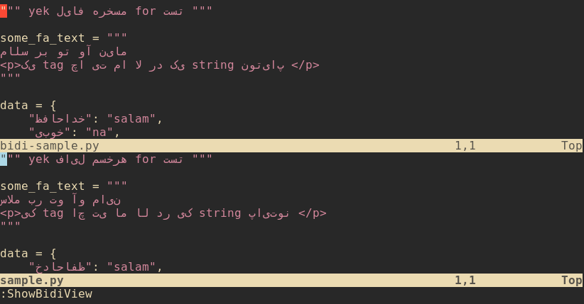

<p dir="rtl">

یه پنجره‌ نئوویم که پنجره‌ی کنونی رو آینه میکنه و کلمات فارسی رو به شکل "صحیح" نشون میده.

نصب با VimPlug :

```lua
Plug 'sehraramiz/bidiview.nvim'
```

- Remaps
```
nnoremap <Leader>bd :ShowBidiView<CR>
nnoremap <Leader>bdx :HideBidiView<CR>
```
پیش نیاز:

```console
pip3 install --user pynvim
```

اگه برای متن‌های درهم فارسی انگلیسی بخوایم نمایش کاراکتر‌ها و جهت حرکت رو (وسط انجام کار) عوض کنیم، مثلا با فشردن کلید e که توقع داریم بریم آخر کلمه (فارسی) میریم اولش، که در اصل همون آخرش هست و در این حالات مغزمون درد خواهد گرفت و وسط یه کد زدن ساده یه چنتا کلمه فارسی جریان کارمون خراب میشه.

روی ترمینال‌های [rxvt-unicode](http://software.schmorp.de/pkg/rxvt-unicode.html) و [st](https://st.suckless.org/) و هر ترمینالی که ترتیب کاراکترها رو دستکاری نکنه استفاده شود.



چون به نظرم  یه جاهایی در مقابل چپ به راست مقاومت نکنیم بهتر هست. [کج و کوله بخون، روون ویرایش کن](http://sehraramiz.ir/ltr.html)

</p>
